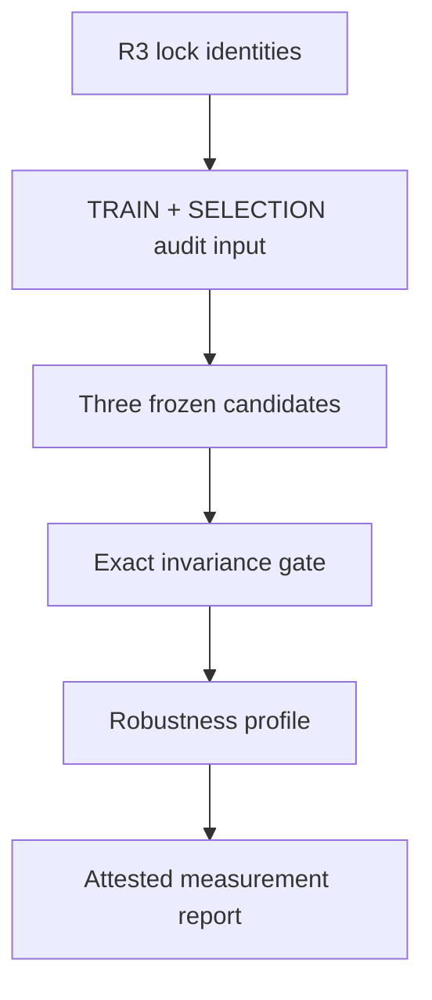

# Narrative Measurement Validity V1 Design

Date: 2026-08-30

Status: written for review

Roadmap: #39 — Real external validation study and post-P3 research frontiers

Integrated implementation base: `proof/narrative-dynamics-v0@4f88a3e7db08f5129610cc73bcca2b38a888a181`

Completed empirical anchor: Empirical Revision 3 scientific revision `d01232979cdfc9d902daab5f9e3e937079b56f69`

Design branch: `work/narrative-measurement-validity-v1-design`

Depends on:

- `docs/superpowers/specs/2026-08-28-narrative-empirical-external-validation-v1-design.md`
- `docs/superpowers/specs/2026-08-29-real-external-validation-two-stage-v1-design.md`

## 1. Purpose

Measurement Validity V1 is a short audit phase between the completed Feher/Hare Study V1 and any future cross-dataset transfer study.

Study V1 answered a protocol-scoped predictive question: under one frozen per-trial first-stage categorical endpoint, the frozen Planning candidate had lower Brier and Log loss than the frozen Intentional and Reactive candidates on the sealed FINAL_TEST partition. That result does not answer whether the endpoint, task canonicalization, or aggregation rule is itself stable.

Measurement Validity V1 therefore asks:

> Without reopening R3 FINAL_TEST or fitting any parameters, is the existing first-stage categorical measurement exactly invariant to semantics-preserving representation changes, and is the model-comparison profile materially dependent on task variant, aggregation unit, or proper scoring rule within the already exposed TRAIN and SELECTION_VALIDATION partitions?

This phase audits the ruler used by Study V1. It is not the reason the models were trained, it does not establish cross-dataset generality, and it does not create a new confirmatory model winner.

## 2. Approved sequencing decision

The chosen architecture separates two questions:

1. **Measurement Validity V1** audits representation and measurement robustness using only already exposed Study V1 partitions and semantics-preserving synthetic transformations.
2. **Cross-dataset Generalization / Transfer V1** will later evaluate the frozen candidate instances on an independent dataset, with zero-shot transfer as the primary analysis and any dataset-specific recalibration as a separately labelled secondary analysis.

### 2.1 Rejected: direct transfer before measurement audit

Directly moving to a second dataset would confound two failure modes: a transfer failure could reflect a domain shift, or it could reflect an unstable endpoint/canonicalization rule. The short measurement audit is retained to make that distinction interpretable.

### 2.2 Rejected: combined measurement, transfer, and recalibration study

A combined study would expose too many adaptive choices at once and would make it unclear whether apparent success came from a reusable model structure, frozen parameters, endpoint changes, or new-data calibration.

### 2.3 Rejected: post-hoc sensitivity over R3 FINAL_TEST

R3 FINAL_TEST is complete and sealed. It must not be reopened to choose a preferred measurement, aggregation, threshold, or transformation. Measurement Validity V1 must not read the sealed R3 prediction artifact, report artifact, FINAL target rows, or FINAL outcome values.

The implementation may use the R3 lock payload as an identity source. It does not import the R3 internal-governance implementation or treat the lock payload as a source of FINAL results.

## 3. Scientific claim boundary

The fixed claim scope is:

```text
external_observational_measurement_audit_only
```

### 3.1 Permitted conclusions

The canonical report may state only protocol-scoped conclusions such as:

- exact categorical-coordinate invariance was met or failed;
- task canonicalization equivalence was met or failed on frozen metamorphic fixtures;
- deterministic execution-order invariance was met or failed;
- a model-comparison direction was stable, inconclusive, or materially measurement-dependent under the frozen audit rules;
- Magic Carpet and Spaceship showed or did not show material task heterogeneity under the audit rule;
- trial-equal and participant-equal aggregation agreed, were inconclusive, or materially disagreed;
- Brier and Log comparison directions agreed, were inconclusive, or materially disagreed;
- an observed reward-by-transition stay/switch diagnostic and a model-implied diagnostic were reported as descriptive convergent evidence.

### 3.2 Forbidden conclusions

The report must not claim or serialize conclusions equivalent to:

- the endpoint is globally or universally valid;
- a latent cognitive construct was validated;
- Planning is the true human cognitive mechanism;
- the frozen parameters generalize to another dataset or population;
- Study V1 became externally preregistered;
- a new confirmatory FINAL result was obtained;
- TRAIN or SELECTION_VALIDATION sensitivity is unbiased held-out predictive evidence.

The audit is conditional on the Feher/Hare source, the frozen Study V1 transform, and the already selected candidate instances.

## 4. Frozen empirical anchor

The audit binds to the immutable R3 lock payload at:

```text
branch: lock/feher-hare-r3-internal-final
commit: f09d6afc96f0a720dd5e8e810f440cda0fe9f8a3
path:   research-locks/feher-hare-r3-internal-final.json
```

Required identities are:

```text
scientific revision:       d01232979cdfc9d902daab5f9e3e937079b56f69
source manifest:           sha256:3609e980af172823cfef78290e7f2337fdb337d67f1f27641e17d473aeedd10d
source snapshot:           sha256:25bdc2e4bff4110f38b098b89e7d59aa38c9658727fcc89a38d50e107d243186
transform:                 sha256:2fb8ab6dc796a9e4ece5653a5485d865ef44dd0f5f7dff92d94a904932d6e541
participant assignment:    sha256:fc144c35f6713e27f75141d678872cc04ca44c7a0fd8e109e8618c72b4111ccf
dataset:                    sha256:17789130372d7eace05e1216a57bdae2ffbd519960333ffe814aee2d2d404781
target specification:      sha256:3134c9dc424418c87379f8e451420fb2defe81b8f30a45d67cd9b1f453349713
TRAIN partition:           sha256:71ce56243338eb23b9dd5ad6dd901e4b0d0be4989742b66bbe7ea4f025f207da
SELECTION partition:       sha256:ecdcfa1681b58888ebf4419372d5de7b75be9624cdd3307144371c5486eb1347
excluded FINAL partition:  sha256:936ffe872644e888111007b300ea847484698be8fbfd7c2d54a177505a411047
excluded FINAL targets:    sha256:927e1727d37993e9a5c887f79ac8712d07a155622deacf0a3122d41f90b16ed2
TRAIN/SELECTION freeze:    sha256:77fa1bb80ab0c7ac737a09a8001f1d0c1432ce3bd991fd7191d07fdd0d8e05d5
```

The three allowed candidate instances are exactly:

| Family | Frozen parameters | Candidate hash |
| --- | --- | --- |
| Reactive | `beta=0.5` | `sha256:42a84ef10c207159ff98397fe2bd86594df6c8be0f41b98e876f7ae33cba9456` |
| Intentional | `beta=2.0`, `memory_decay=0.5` | `sha256:68a01b5496e20095c1a603b30f1384bbe6a3ea22aac8cf74b7b97463c4935839` |
| Planning | `beta=4.0`, `memory_decay=0.75` | `sha256:c0ed956c1b285153075e5a22e7fb51f6d53dcf8ad326cce82e39e0221c2e877c` |

No other parameter tuple or model family may enter the audit.

## 5. Information firewall

Measurement Validity V1 must enforce a stronger boundary than documentation alone.

### 5.1 Allowed empirical material

The audit may consume:

- the frozen source manifest and verified upstream snapshot;
- the Study V1 transform and participant assignment;
- TRAIN records and target report;
- SELECTION_VALIDATION records and target report;
- the three frozen candidate identities and parameters;
- the original TRAIN seeds `(101, 102)` and SELECTION seeds `(201, 202)` for selected-candidate audit predictions;
- synthetic/metamorphic fixtures that contain no real human rows.

Running the three already frozen candidates over allowed partitions is an audit execution, not a new training pass. Candidate-grid enumeration, acceptance-set construction, parameter ranking, and `FrozenModelSpec.from_selection()` are forbidden.

### 5.2 Forbidden empirical material

The audit must not consume:

- FINAL_TEST records or targets;
- R3 sealed prediction rows;
- R3 Brier, Log, diagnostic, comparison, or report results as analytic inputs;
- the identity of the R3 winning family as an optimization target;
- unselected parameter candidates;
- published fitted parameters or model labels from the upstream study.

The excluded FINAL partition and target hashes may appear only as negative lineage assertions proving what the audit did not consume.

### 5.3 Partition-restricted input type

Add a frozen `MeasurementAuditInput` contract that owns only:

- dataset/source/transform identities;
- allowed TRAIN and SELECTION partition identities;
- allowed target-report identities;
- frozen candidate identities;
- task and participant metadata required for aggregation;
- excluded FINAL partition and target identities;
- claim scope.

The input carries immutable `MeasurementAuditCase` projections containing only the allowed scenario, one-hot first-stage target, task stratum, opaque participant-group hash, record hash, and partition role required for the audit. It must not contain an `ObservationDataset`, `PreparedFeherHareTwoStageV1`, FINAL target report, direct participant identifier, source path, or general partition lookup method.

Construction fails unless every projected case is TRAIN or SELECTION_VALIDATION, every case identity is unique, and a canonical commitment over the allowed record identities matches the frozen allowed-partition identities.

### 5.4 Trusted provisioning boundary

Reproducing the frozen participant assignment may require the existing Study V1 preparation code to verify the complete source snapshot and transform identity. That trusted provisioning step is separate from the measurement engine:

1. it verifies the full source/dataset/assignment commitments against section 4;
2. it emits only TRAIN and SELECTION_VALIDATION `MeasurementAuditCase` projections;
3. it emits the frozen FINAL partition and target hashes as negative commitments;
4. it does not emit FINAL scenarios, targets, outcomes, record ids, or participant ids;
5. the measurement engine accepts only the restricted projection payload.

Accordingly, the canonical claim is not that source verification never touched a file assigned to FINAL. The enforceable claim is that no FINAL value was exposed to or analyzed by the measurement audit and that no FINAL model execution occurred.

## 6. Chosen mixed-gate protocol

Measurement Validity V1 separates exact representational requirements from empirical robustness descriptions.

### 6.1 Hard gate: exact representational invariance

The following checks are mandatory. Any failure makes the audit RED and prevents a robustness conclusion.

#### A. Categorical coordinate permutation

For the only non-identity binary permutation `action_0 <-> action_1`, simultaneously permuting target and prediction coordinates must preserve:

- probability normalization;
- per-record Brier loss;
- per-record Log loss;
- aggregate losses under every frozen aggregation rule;
- pairwise loss deltas;
- canonical report status after inverse mapping.

No tolerance wider than the existing loss probability tolerance may be introduced. Finite floating-point comparisons use exact equality where operations are coordinate permutations only; otherwise they use the existing declared `1e-12` probability tolerance.

#### B. Task canonicalization equivalence

Frozen synthetic Magic Carpet counterbalancing pairs and Spaceship symbol-order pairs that are semantically identical must construct identical canonical targets and semantically identical model-visible scenarios.

The fixtures must cover coherent permutations of:

- first-stage action labels;
- second-stage action labels;
- `state_0` / `state_1` labels;
- Magic Carpet displayed positions/config identities;
- Spaceship displayed symbol order and relative-choice reconstruction;
- every affected retained-history field.

After inverse mapping, all three frozen model families must produce the same first-stage policy and loss identity for each paired fixture.

#### C. Deterministic order and executor invariance

Record ordering, batch boundaries, and supported serial/process execution must not change:

- selected-candidate prediction identities;
- per-record metric identities;
- aggregate rows;
- audit report content hash.

This check is synthetic or uses allowed TRAIN/SELECTION records only. It must not invoke a parameter grid.

### 6.2 Empirical robustness profile

After the hard gate passes, compute a descriptive robustness profile over the allowed partitions.

#### A. Task-stratified comparison

Compute every model's Brier and Log loss separately for:

- `magic_carpet`;
- `spaceship`.

Report pairwise model loss deltas within each task. A task reversal is **material** only when the preferred direction reverses between tasks and the absolute delta in both opposing directions meets the existing Study V1 score-specific separation reference:

```text
Brier: 0.005
Log:   0.006931471805599453
```

Anything weaker is reported as inconclusive heterogeneity, not as equivalence.

#### B. Aggregation-unit comparison

Compute both:

- `trial_equal`: every retained trial has equal weight;
- `participant_equal`: compute each participant's mean loss first, then give every participant equal weight.

A comparison is materially aggregation-dependent only if the preferred direction reverses and both opposing deltas meet the same score-specific separation reference. A direction change below the reference is reported as inconclusive sensitivity.

#### C. Proper-score comparison

Compare Brier and Log pairwise directions under each aggregation and task stratum. A score-rule dependence status requires materially opposing directions under the score-specific separation references. Lack of separation under one score is not automatically disagreement.

#### D. Participant influence

For every task, score, aggregation, and model pair, compute deterministic leave-one-participant-out deltas. Report the full minimum/maximum influence range and whether removal of one participant creates a material reversal. No random bootstrap seed or adaptive confidence procedure is introduced in V1.

### 6.3 Descriptive convergent behavioral diagnostic

Compute the traditional two-stage stay/switch diagnostic from consecutive retained trials within each participant.

For a prior trial, define:

```text
stay = next first-stage canonical action equals prior first-stage canonical action
```

Estimate stay probability by prior reward and prior transition type (`common` / `rare`), stratified by task. The model-based interaction summary is:

```text
[stay(rewarded, common) - stay(unrewarded, common)]
- [stay(rewarded, rare) - stay(unrewarded, rare)]
```

Compute the observed human summary and a model-implied expected summary from each frozen candidate's next-trial first-stage policy. This diagnostic is report-only in V1:

- it is not a training target;
- it does not choose or reject a candidate;
- it does not alter the hard gate;
- it does not prove a planning mechanism;
- an empty cell or insufficient task-specific support is emitted explicitly as `NOT_ESTABLISHED`, never silently dropped or imputed.

## 7. Architecture

Add one generic contract module and one Study V1-specific composition module:

```text
narrative_dynamics/measurement_validity.py
narrative_dynamics/studies/feher_hare_measurement_validity_v1.py
```

The generic module owns immutable protocol/report types, coordinate-permutation checks, aggregation definitions, material-reversal classification, participant influence summaries, and fixed claim vocabulary.

The study module owns only Feher/Hare identity binding, partition-restricted input construction, task strata, the stay/switch projection, selected-candidate audit execution, and final report assembly.



The architecture must reuse existing `ObservationRecord`, target construction, categorical losses, candidate execution, stable content hashes, and report attestation. It must not create a second dataset framework, calibration engine, loss implementation, or external-final path.

## 8. Canonical protocol and report

### 8.1 `MeasurementValidityProtocol`

The frozen protocol includes:

- protocol name/version and fixed claim scope;
- empirical-anchor identities from section 4;
- exactly two allowed partition roles;
- exactly three candidate hashes;
- selected-candidate execution seeds by partition;
- exact semantic permutations;
- task strata;
- `trial_equal` and `participant_equal` aggregation rules;
- Brier and Log identities;
- score-specific material-reversal references;
- leave-one-participant-out influence rule;
- stay/switch diagnostic definition;
- excluded FINAL identities;
- implementation identities for every callable used to transform, predict, aggregate, classify, and report.

All fields are content-hashed. Unknown fields, reordered semantic sets without canonicalization, duplicate identities, non-finite thresholds, or any FINAL role fail closed.

### 8.2 Typed result statuses

The report uses typed statuses rather than a free-text scientific conclusion. At minimum it distinguishes:

```text
EXACT_INVARIANCE_MET
EXACT_INVARIANCE_FAILED
STABLE_UNDER_FROZEN_AUDIT
MATERIALLY_MEASUREMENT_DEPENDENT
INCONCLUSIVE_SENSITIVITY
NOT_ESTABLISHED
```

`EXACT_INVARIANCE_FAILED` is the only hard-gate failure status. Empirical dependence is a substantive finding, not an infrastructure failure and not permission to alter Study V1.

`STABLE_UNDER_FROZEN_AUDIT` means only that the frozen material-reversal rule found no opposing direction meeting its reference margins. It is not an equivalence claim. Dependence and sensitivity statuses are emitted per dimension and model pair; the report does not collapse them into an unrestricted statement that the measurement is valid.

### 8.3 `MeasurementValidityReport`

The immutable report binds:

- protocol and empirical-anchor hashes;
- allowed partition and target hashes;
- excluded FINAL hashes;
- candidate and execution-manifest hashes;
- exact-invariance case results;
- per-model/per-score/per-task/per-aggregation losses;
- pairwise deltas and typed dependence statuses;
- leave-one-participant-out influence ranges;
- observed and model-implied stay/switch summaries;
- record, participant, and diagnostic-cell counts;
- explicit `parameter_training_performed=false`;
- explicit `parameter_selection_performed=false`;
- explicit `final_test_values_exposed_to_audit=false`;
- explicit `final_test_outcomes_analyzed=false`;
- explicit `final_model_execution=false`;
- fixed claim scope;
- report content hash and repository attestation.

Raw human rows, record-level choices, and participant identifiers must not enter the persisted report artifact. Canonical record hashes and aggregate counts are sufficient for audit lineage.

## 9. Execution and artifact policy

Ordinary CI covers synthetic contracts, metamorphic fixtures, and deterministic integration fixtures. It must not fetch the upstream human-data repository.

The real measurement audit runs only through an explicit manual workflow pinned to:

- the approved scientific implementation SHA;
- the immutable R3 lock payload;
- the verified upstream source snapshot;
- the exact protocol hash.

The workflow must:

1. verify every frozen input identity;
2. run the trusted provisioner and construct the partition-restricted audit input;
3. prove zero FINAL cases or values are present in the audit input;
4. execute only the three frozen candidates on TRAIN and SELECTION_VALIDATION;
5. run the exact invariance gate;
6. assemble the empirical robustness profile and diagnostic;
7. persist the report and execution manifests on success or failure using an always-run artifact step.

Infrastructure failures may be replayed against the exact same protocol and implementation SHA because this is not a sealed FINAL pass. Every attempt remains disclosed. A scientific hard-gate failure is not automatically retried or repaired by changing the protocol.

## 10. Error handling

The implementation fails closed on:

- any empirical-anchor, partition, target, or candidate hash mismatch;
- any requested role other than TRAIN or SELECTION_VALIDATION;
- any FINAL scenario, record id, target, outcome, prediction, or report value entering the audit input;
- a call to parameter-grid, acceptance-set, selection, or freeze construction;
- missing task or participant metadata required for aggregation;
- non-canonical task/action/state values;
- empty task strata;
- duplicate prediction or execution-manifest identities;
- non-finite probabilities, losses, deltas, or influence summaries;
- an unrecognized aggregation, score, transformation, or result status;
- report serialization that includes raw human rows or direct participant identifiers.

Insufficient support for one stay/switch cell is a typed `NOT_ESTABLISHED` diagnostic, not a crash and not silent omission.

## 11. Test strategy

Implementation follows RED -> GREEN.

### 11.1 Contract tests

Tests require:

- fixed claim scope and closed status vocabulary;
- canonical protocol/report hashing;
- exact allowed candidate and partition cardinalities;
- negative FINAL lineage assertions;
- no free-text canonical conclusion;
- no raw-row or participant-id serialization;
- report attestation over the exact report artifact.

### 11.2 Metamorphic tests

Tests cover:

- binary categorical coordinate permutation;
- coherent action/state permutation across history, target, and prediction;
- Magic Carpet position/config counterbalancing;
- Spaceship symbol-order and relative-choice equivalence;
- same-trial post-choice mutation preserving the model-visible scenario;
- record order, batch boundary, and serial/process executor invariance.

### 11.3 Scientific-boundary tests

Tests prove that:

- only the three frozen candidate hashes can execute;
- no parameter grid or selection API is called;
- no FINAL partition/target/prediction/report value is consumed;
- task, aggregation, score, influence, and diagnostic formulas match frozen reference vectors;
- material reversal, inconclusive sensitivity, and stability statuses are distinguished correctly;
- empty diagnostic cells emit `NOT_ESTABLISHED`.

### 11.4 Real audit evidence

The manual real audit is GREEN only when:

- the workflow exact head matches the approved scientific SHA;
- all frozen source/data/candidate identities match section 4;
- the exact invariance hard gate is GREEN;
- the complete robustness profile is present;
- aggregate row counts reconcile with allowed TRAIN/SELECTION records;
- persisted artifact inspection confirms zero FINAL cases/values and zero raw human rows;
- `parameter_training_performed=false`;
- `parameter_selection_performed=false`;
- `final_test_values_exposed_to_audit=false`;
- `final_test_outcomes_analyzed=false`;
- `final_model_execution=false`.

A scientific RED is valid only when the same source/data/candidate identities match, the exact-invariance failure reproduces on frozen fixtures, the failure artifact persists, and all zero-training/zero-selection/zero-FINAL assertions above remain true.

## 12. Acceptance gates

Measurement Validity V1 has three terminal classes:

- **GREEN**: the exact hard gate passes and the complete empirical robustness profile is attested;
- **SCIENTIFIC RED**: an exact invariant fails reproducibly and an attested failure report is frozen; Transfer V1 is blocked pending a new measurement revision;
- **INFRASTRUCTURE INCOMPLETE**: identity verification, execution, or artifact persistence fails before a scientific result; exact-input replay is allowed and the phase remains open.

The phase reaches a scientific terminal state only after:

1. this design and its implementation plan are approved;
2. test-only RED commits establish the input firewall, exact invariance, classification, and report boundaries;
3. the minimal implementation turns each RED gate GREEN;
4. ordinary exact-head CI is fully GREEN;
5. one pinned real TRAIN/SELECTION-only audit produces an attested success or scientific-failure artifact;
6. the artifact is independently checked for identity consistency and zero FINAL values exposed to or analyzed by the audit;
7. #39 records the typed measurement findings without rewriting Study V1 conclusions;
8. if and only if the hard gate is GREEN, a separate Transfer V1 design issue is opened before selecting or ingesting a second dataset.

No acceptance result authorizes reopening R3 FINAL_TEST or retuning the R3 candidates.

## 13. Transfer V1 handoff

Measurement Validity V1 does not itself establish generality. It prepares a clean handoff for the separate transfer study.

Transfer V1 must preserve the following hierarchy of claims:

1. **Frozen-parameter zero-shot success** supports transfer of the frozen candidate instance under the new protocol.
2. **Failure zero-shot but success after new-data calibration** supports structural portability, not universal parameters.
3. **Failure after both zero-shot evaluation and properly held-out recalibration** supports domain specificity under the tested protocols.

The second dataset, transform, splits, missing-data rules, zero-shot thresholds, and recalibration protocol are not chosen in this design. They require a new architectural spec and fresh freeze. Zero-shot results must be sealed before any recalibration analysis is allowed to inspect its held-out test outcomes.

An exact-invariance failure blocks Transfer V1 until a new measurement revision is frozen. Material empirical dependence does not automatically block transfer, but every affected task/aggregation/score dimension must be carried forward as a preregistered stratum or sensitivity analysis; Transfer V1 may not choose whichever measurement version favors a model.

## 14. Non-goals

Measurement Validity V1 does not add:

- a new model family;
- a larger parameter grid;
- participant-specific or hierarchical parameters;
- online or per-trial retraining;
- full sequence likelihood;
- causal identification;
- survey weighting or population inference;
- a public multi-dataset benchmark;
- a second external dataset;
- a revised R3 report;
- a new FINAL_TEST execution.

Those remain separate research frontiers tracked by #39.
